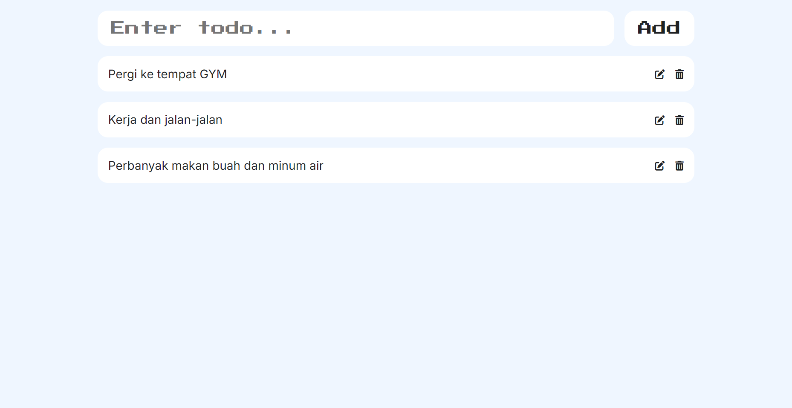

# Simple Todo List

"Simple TodoList" is a straightforward task management app that allows users to easily create, view, update, and delete tasks. With a clean and intuitive design, it helps users stay organized and focused on their daily to-dos without unnecessary distractions.

## Tech Stack

**Client:** React.Js, Redux

<!-- **Server:** Node, Express -->

## Demo

https://simple-tod0.netlify.app

## Screenshots



<!-- 

 -->

<!-- <div style="display: grid; grid-template-columns: 1fr 1fr; grid-template-rows: 1fr 1fr; gap: 10px;">
  

  

  
</div> -->

## Run Locally

Clone the project

```bash
  git clone https://github.com/tiedsandi/project_simple-todo
```

Go to the project directory

```bash
  cd simple-todo
```

Install dependencies

```bash
  npm install
```

Start the server

```bash
  npm run dev
```

<!-- ## Running Tests

To run tests, run the following command

```bash
  yarn test
``` -->

<!-- ## Optimizations

What optimizations did you make in your code? E.g. refactors, performance
improvements, accessibility -->

<!-- ## Appendix

Any additional information goes here -->

# Hi, I'm Fachran! 👋

## 🚀 About Me

I am a web developer based Jakarta, Indonesia. With a passion for continuous learning and growth, I focus on building interactive and responsive user interfaces. I have experience developing web applications using modern technologies like React.js, Redux, and SASS, along with design skills in Figma to ensure both aesthetics and functionality.

## 🛠 Skills

I am proficient in programming languages like JavaScript, as well as front-end technologies such as HTML, CSS, and popular frameworks like Bootstrap. Additionally, I am experienced in integrating Restful APIs to build dynamic, backend-connected applications.

I strive to create innovative, user-friendly solutions and am eager to contribute to dynamic and collaborative development teams.

## 🔗 Links

[](https://fachran-sandi.netlify.app/)
[](https://www.linkedin.com/in/fachransandi/)
